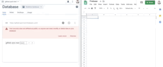
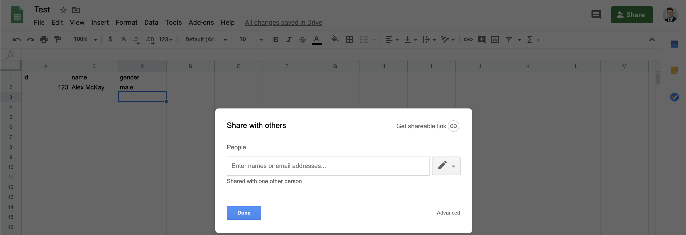

# UPDATE: I will be updating this repo sometime in either June or July

# Sync Firebase With Google Sheets

## Overview

### Purpose

- To provide a simple method to syncronise a Google Sheet file with a Realtime Database.
- Google Sheets provides a simple interface for non-programmers to add, edit and delete data whilst the Firebase API provides an effective interface to make programmatic read/write request to the data.

### Features

- Multiple sheets.
- No column or row range restrictions.
- Single cell updates (Firebase --> Sheets).
- Instantaneous (~1 second delays)
- Free

### Testing

- The project aims for approximately 85-90% test coverage.
- Any contributions should include necessary tests.

## Getting Started

#### Installations

- Clone repo
- `yarn install`
- `cd functions && npm install && cd ..`

### Firebase

1. Create a Firebase project
   
2. Copy the DB Url

### Sheets to Firebase

1. Create a new Google Sheet
2. Change the file name from 'Untitled Spreadsheet' to 'Firebase' (non-essential)
3. Change the sheet name from 'Sheet 1' to 'Users' (non-essential)
4. Open the 'Tools' menu
5. Open 'Script Editor' 
6. Change the script name from 'Untitled' to 'Firebase' (non-essential)
7. Open the 'View' menu
8. Click 'Show manifest file'
9. Open `appscript.json` and add the following oAuth scopes

```jsonc
{
  // other stuff
  "oauthScopes": [
    "https://www.googleapis.com/auth/userinfo.email",
    "https://www.googleapis.com/auth/firebase.database",
    "https://www.googleapis.com/auth/script.external_request"
  ]
}
```

10. Open `Code.gs`
11. Delete all the existing code in `Code.gs` and replace it with the code from `appscript/update-firebase.js`, taking care not to include the imports/exports which are for testing purposes only.
12. Update the `dbUrl` in the `formatUrl` function.
13. Open the 'Edit' menu
14. Open 'Current Project Triggers'
15. Click 'Add Trigger'
16. Add the following settings:
    
17. Click 'Save' (may have to scroll slightly)
18. Click 'Advanced' on the 'This App isn't Verified' pop-up
19. Click 'Go to Firebase'
20. Click 'Allow'
21. This is what you should see when you edit the sheet:
    

## Firebase to Sheets

### Authentication

1. Sign into the same Google account you used to create the spreadsheet.
2. Go to the [Google Console](https://console.cloud.google.com/).
3. Create a new project or select an existing one.
4. Click 'Create Credentials' and generate a service account.
5. Set 'Role' to 'Owner'.
6. Download file.
7. Enable the Sheet API for you service account (screenshot)
8. Copy the spreadsheet Url
9. Run `node utils/id-extract.js <PASTE SPREADSHEET URL>`
10. Move the service account file you downloaded into `functions/config` dir and rename it to `service-account.json`.
11. Share the spreadsheet with the service account email available in the `service-accont.json` file and uncheck `Notify People`.
    

### Attach to Firebase

1. Show all available Firebase projects - `firebase projects:list`
2. Helper to select the one you would like to use - `firebase use --add`
3. Deploy functions - `firebase deploy --only functions`
4. Make sure everything is working.
5. Tighten up restrictions with the read/write rules.

## AppScript

### Pitfalls

- AppScript does not have feature parity with JavaScript. It only recently (early 2020) made the jump to ES6. Whilst most of the features you would expect have been added. Some such as the `...` operator have not. Using modern features can cause your code to fail silently so test consistently if you decide to refactor or add further code.
- In Google Sheets (AppScript), you _may_ have to select the option __Run > Enable New App Script Runtime Powered By Chrome V8__ in order for your code to work.
- Don't forget to save!!!
