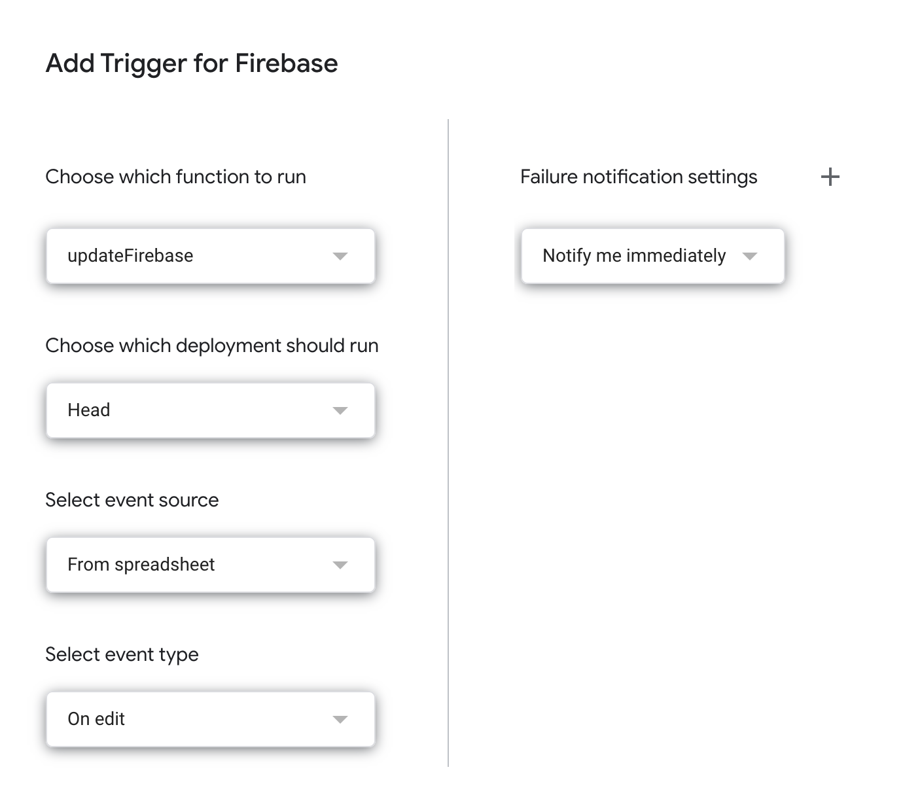

# Sync Firebase With Google Sheets

## Overview

### Purpose

- To provide a simple method to syncronise a Google Sheet file with a Realtime Database.
- Google Sheets provides a simple interface for non-programmers to add, edit and delete data whilst the Firebase API provides an effective interface to make programmatic read/write request to the data.

### Features

- Multiple sheets.
- Add/remove cells, columns or rows as you normally would.
- Single cell updates (Firebase --> Sheets).
- Authentication: you can restrict access to sheet to limited number of users.

### Testing

- The project aims for approximately 85-90% test coverage.
- Any contributions should include necessary tests.

## Getting Started

#### Installations

- Clone repo
- `yarn install`
- `cd functions && npm install && cd ..`

### Sheets to Firebase

1. Create a new Google Sheet
2. Change the file name from 'Untitled Spreadsheet' to 'Firebase' (non-essential)
3. Change the sheet name from 'Sheet 1' to 'Users' (non-essential)
4. Open the 'Tools' menu
5. Open 'Script Editor'
6. Change the script name from 'Untitled' to 'Firebase' (non-essential)
7. Open the 'View' menu
8. Click 'Show manifest file'
9. Open `appscript.json` and add the following oAuth scopes

```jsonc
{
  // other stuff
  "oauthScopes": [
    "https://www.googleapis.com/auth/userinfo.email",
    "https://www.googleapis.com/auth/firebase.database",
    "https://www.googleapis.com/auth/script.external_request"
  ]
}
```

10. Open `Code.gs`
11. Copy the code from `appscript/update-firebase.js` taking care not to include the imports/exports which are for testing purposes only.
12. Open the 'Edit' menu
13. Open 'Current Project Triggers'
14. Click 'Add Trigger'
15. Add the following settings:
    

- Code breakdown

- Update `dbUrl`

- `yarn test` (expect to fail). This
